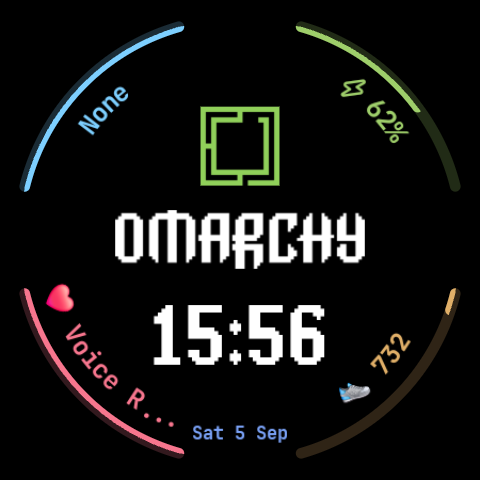

# ⌚ Omarchy Galaxy Watch Face

> **"Beautiful, Fun & Agentic Linux" on your wrist.**  
> A declarative, battery-optimized Wear OS watch face crafted in official **Watch Face Format (WFF v2)** for modern Samsung Galaxy Watch models.

<p align="center">
  
</p>

<p align="center">
  <a href="https://gladimdim.github.io/galaxy-watch-omarchy/"><strong>🌐 Live Website</strong></a> &bull;
  <a href="https://gladimdim.github.io/galaxy-watch-omarchy/privacy.html"><strong>🔒 Privacy Policy</strong></a> &bull;
  <a href="#-installing-on-your-galaxy-watch-step-by-step"><strong>📲 Installation Guide</strong></a>
</p>

---

## 🧭 Compatibility Guide: Can You Test on "Galaxy Watch 2"?

### The Short Answer
* **If you have a Samsung Galaxy Watch Active 2 (or original Galaxy Watch / Watch 3):**  
  These watches run Samsung's legacy **Tizen OS** (Tizen 4.0 / 5.5), **not** Android/Wear OS. Samsung and Google discontinued the Tizen Galaxy Store in 2024–2025 and completely transitioned to Wear OS. Modern Watch Face Format (`.apk` / WFF) cannot run on Tizen OS without ancient, deprecated Tizen Studio tooling.
* **If you have a Galaxy Watch 4, Watch 5, Watch 6, Watch 7, or Watch Ultra:**  
  **Yes, 100% compatible!** These watches run Google's **Wear OS** (One UI Watch) and natively execute this project via Watch Face Format (WFF).

| Device Family | Operating System | Watch Face Format (WFF) | APK Sideloading (ADB) |
|---|---|---|---|
| **Galaxy Watch Active 2 (2019)** | Tizen OS 4.0 / 5.5 | ❌ Unsupported (Tizen legacy) | ❌ (`.tpk` only) |
| **Galaxy Watch 3 (2020)** | Tizen OS 5.5 | ❌ Unsupported (Tizen legacy) | ❌ (`.tpk` only) |
| **Galaxy Watch 4 & 4 Classic** | Wear OS 3.5 / 4.0 / 5.0 | ✅ Supported | ✅ Yes (Wi-Fi ADB) |
| **Galaxy Watch 5 & 5 Pro** | Wear OS 4.0 / 5.0 | ✅ Supported | ✅ Yes (Wi-Fi ADB) |
| **Galaxy Watch 6 & 6 Classic** | Wear OS 4.0 / 5.0 | ✅ Supported | ✅ Yes (Wi-Fi ADB) |
| **Galaxy Watch 7 & Watch Ultra**| Wear OS 5.0+ | ✅ Supported (WFF Required) | ✅ Yes (Wi-Fi ADB) |

---

## 🚀 Capabilities & Features

1. **Official Omarchy Visual Identity:**
   - Vector-accurate **Omarchy Arch Icon** in official Omarchy Green (`#9ECE6A`).
   - Exact pixel-art **OMARCHY** wordmark matching [omarchy.org](https://omarchy.org/).
   - Official system font: **JetBrains Mono Nerd Font** (Bold & Regular) bundled directly in the APK.
   - Slogan / Tagline: `SAT 05 SEP • BE THE OMARCH`.

2. **4 Dynamic Complications (Live Info + 1-Tap App Launchers):**
   - ⚡ **Top (12 o'clock):** Battery Level percentage & status (`WATCH_BATTERY`). Tapping launches Power Management.
   - 👟 **Bottom (6 o'clock):** Step Counter & daily activity (`STEP_COUNT`). Tapping launches Samsung Health / Google Fit.
   - ♥ **Left (9 o'clock):** Heart Rate monitor / BPM (`HEART_RATE`). Tapping opens Heart Rate monitor.
   - ⛅ **Right (3 o'clock):** Weather / Next Event / Quick App shortcut (`WEATHER` / `NEXT_EVENT`).
   - *Fully Customizable:* You can long-press the watch face on your watch to customize any slot with any installed Wear OS app.

3. **Always-On Display (AOD) / Ambient Mode:**
   - Automatic battery-saving mode when your wrist drops.
   - Deep `#000000` OLED background (0 mA power draw on inactive pixels).
   - Minimalist dimmed branding and low-power monochrome clock to prevent burn-in.

---

## 🛠️ Installed Tools & SDK Environment

Your development environment has been fully configured with:
* **Java:** OpenJDK 21 (`mise use -g java@21.0.2`)
* **Gradle:** Version 8.7 (`./gradlew`)
* **Android SDK:** Platform 34 (Android 14 / Wear OS 5) & Build-Tools 34.0.0
* **ADB:** Android Debug Bridge installed to `~/.local/bin/adb`
* **Local SDK path:** Configured in `local.properties` (`~/.local/share/android/sdk`)

---

## 🔨 Building the Watch Face

To build a fresh debug APK:

```bash
cd /home/gladimdim/Github/galaxy-watch-omarchy
./gradlew assembleDebug
```

The compiled APK will be generated at:
```
app/build/outputs/apk/debug/app-debug.apk
```

---

## 📲 Installing on Your Galaxy Watch (Step-by-Step)

### Step 1: Enable Developer Options on the Watch
1. On your Galaxy Watch, go to **Settings > About watch > Software info**.
2. Tap **Software version** repeatedly 7 times until you see the toast: *"Developer mode turned on"*.

### Step 2: Enable Wireless Debugging
1. Go back to **Settings > Developer options**.
2. Turn on **ADB debugging**.
3. Turn on **Wireless debugging** (make sure the watch is connected to the same Wi-Fi network as your PC).
4. Tap **Pair new device with pairing code**. Note down the **IP address:Port** and the **6-digit pairing code**.

### Step 3: Pair and Deploy
Run the automated deployment helper:

```bash
./deploy.sh
```

Choose **Option 2** to pair and connect:
```
Enter Watch IP:Port for pairing (e.g. 192.168.1.50:37123): 192.168.1.50:37123
Enter 6-digit Wi-Fi pairing code: 123456
Enter main Wireless Debugging IP:Port: 192.168.1.50:41234
```

Or execute manually via ADB:
```bash
adb pair 192.168.1.50:37123 123456
adb connect 192.168.1.50:41234
adb install -r app/build/outputs/apk/debug/app-debug.apk
```

### Step 4: Activate on Watch
1. Long-press your current watch face on the Galaxy Watch.
2. Swipe all the way to the right and tap **+ Add watch face**.
3. Select **Omarchy** from the downloaded watch faces list.

---

## 🎨 Project Structure

```
galaxy-watch-omarchy/
├── app/
│   ├── src/main/
│   │   ├── AndroidManifest.xml          # Watch Face Format manifest (hasCode=false)
│   │   └── res/
│   │       ├── drawable/                # Omarchy logos, icons, and vector complication assets
│   │       ├── font/                    # JetBrains Mono Bold & Regular TTF
│   │       ├── mipmap-nodpi/            # App launcher icon
│   │       ├── raw/
│   │       │   └── watchface.xml        # Declarative WFF watch face definition
│   │       ├── values/                  # Strings & color palette definitions
│   │       └── xml/watch_face.xml       # Wallpaper service descriptor
│   └── build.gradle
├── preview/                             # Rendered watch mockups (Active & Ambient)
├── deploy.sh                            # Interactive Wi-Fi ADB pairing & installation script
├── build.gradle
├── settings.gradle
└── README.md
```
