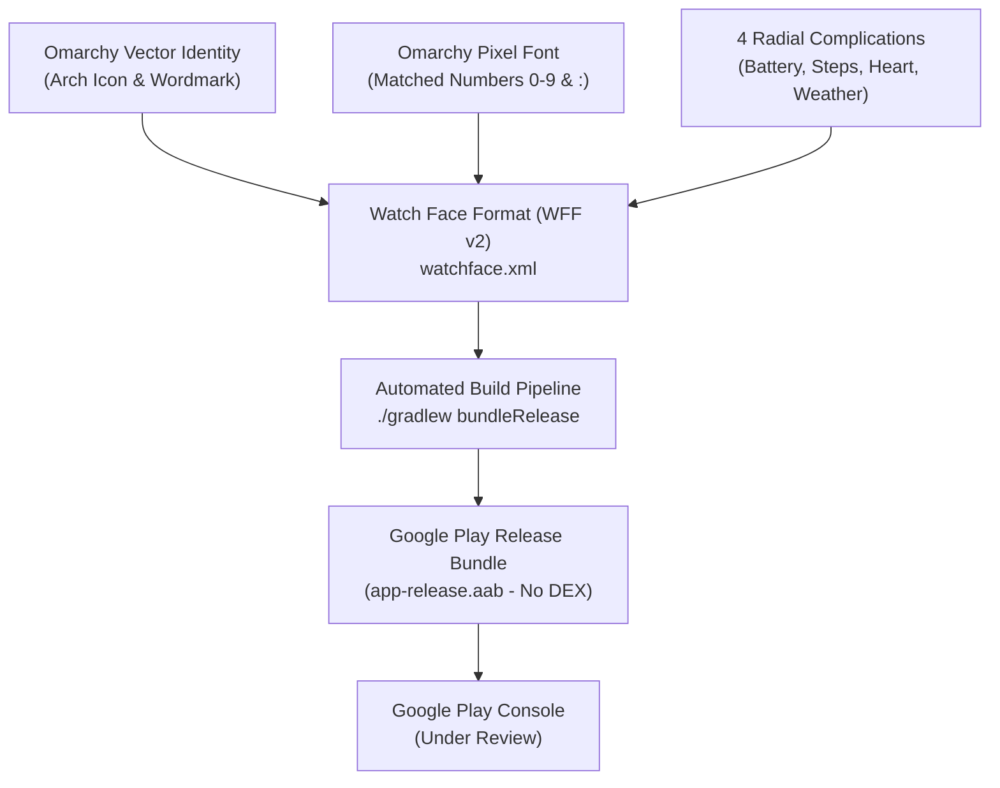

# ⌚ Omarchy Galaxy Watch Face — Project Wrap-up & Submission Guide

> **Current Status:** 🌔 **In Review** on Google Play Console (Submission #1)  
> **Target Devices:** Samsung Galaxy Watch Ultra (`SM-L705F`), Galaxy Watch 4 / 5 / 6 / 7, Pixel Watch 2 / 3, and all Wear OS 5+ devices.

---

## 📌 Executive Summary

The **Omarchy Watch Face** is a battery-optimized, privacy-first watch face designed for Wear OS, bringing the official Omarchy Linux visual aesthetic to your wrist. It is built strictly using Google’s **Watch Face Format (WFF v2)** (`hasCode="false"`), complying with Google Play's mandatory standard (enforced as of January 27, 2025).



---

## 📋 Release & Store Listing Credentials

| Parameter | Value |
| :--- | :--- |
| **Application Name** | `Omarchy Watch Face` |
| **Package Name / Application ID** | `com.gladimdim.omarchy.watchface` |
| **Current Version** | `1.0.3` |
| **Version Code** | `4` |
| **Min SDK** | `34` (Android 14 / Wear OS 5) |
| **Target SDK** | `35` (Android 15) |
| **Compile SDK** | `34` |
| **Category** | `Personalization` (Tags: `Watch faces`) |
| **Content Rating** | PEGI 3 / Everyone (All violence/data questions: No) |
| **Data Safety** | No data collected, tracked, or shared |

---

## 🌐 Public URLs & Infrastructure

- **GitHub Repository:**  
  [https://github.com/gladimdim/galaxy-watch-omarchy](https://github.com/gladimdim/galaxy-watch-omarchy)
- **Live Landing Page (GitHub Pages):**  
  [https://gladimdim.github.io/galaxy-watch-omarchy/](https://gladimdim.github.io/galaxy-watch-omarchy/)
- **Live Privacy Policy (Mandatory for Play Store):**  
  [https://gladimdim.github.io/galaxy-watch-omarchy/privacy.html](https://gladimdim.github.io/galaxy-watch-omarchy/privacy.html)

---

## 🎨 Design & Layout Specifications

1. **Official Omarchy Green Arch Icon:**
   - Coordinates: `x="188" y="100"`, dimensions: `74x74` (1.3x scale).
   - Color: Official Omarchy Green (`#9ECE6A`).
   - Ambient Mode: Dimmed to `alpha="80"`.
2. **Official Omarchy Pixel-Art Wordmark:**
   - Coordinates: `x="108" y="197"`, dimensions: `234x55` (1.3x scale).
   - Perfectly centered vertically and horizontally on the 450x450 canvas.
   - Ambient Mode: Dimmed to `alpha="130"`.
3. **Digital Time (Omarchy Typography):**
   - Font: `app/src/main/res/font/omarchy.ttf` (open-source vector font matching the official wordmark pixel grid).
   - Coordinates: `x="25" y="276"`, dimensions: `400x76`, `size="70"`.
   - Color: `#ffffffff` (Active) / `#ffc0caf5` (Ambient).
4. **6 o'clock Date:**
   - Coordinates: `x="25" y="392"`, dimensions: `400x28`.
   - Font: `jetbrains_mono_bold` at `size="17"`.
   - Format: `[DAY_OF_WEEK_S] [DAY] [MONTH_S]` (e.g., `Sat 5 Sep`).
   - Color: `#ff7aa2f7` (Active) / `#ff565f89` (Ambient).
5. **4 Radial Bezel Complications:**
   - **Top-Right (16° to 76°):** Battery Level percentage & dynamic gauge track (`#9ece6a`).
   - **Bottom-Right (104° to 164°):** Step Counter & daily progress track (`#e0af68`).
   - **Bottom-Left (196° to 256°):** Heart Rate BPM & dynamic gauge track (`#f7768e`).
   - **Top-Left (284° to 344°):** Weather / Day of Week / Calendar (`#7dcfff`).
   - Curved text rendered along the bezel with `TextCircular` (`size="24-25"`).

---

## 🛠️ Build Pipeline & Automation

Google Play strictly mandates that WFF bundles **cannot contain any `.dex` files**. We solved this automatically in Gradle:

### Automated WFF Task (`finalizeWatchFaceBundle`)
Located in [app/build.gradle](file:///home/gladimdim/Github/galaxy-watch-omarchy/app/build.gradle#L35-L65):
1. Strips `base/dex/classes.dex` and `META-INF/` from the `.aab`.
2. Re-signs the bundle with `jarsigner` using `release.keystore`.
3. Guarantees 100% compliance with Google's `DeclarativeWatchFaceBundleValidator`.

### Useful Commands:

```bash
# Build signed Google Play Bundle (.aab)
./gradlew bundleRelease

# Build debug APK for local watch testing
./gradlew assembleDebug

# Deploy directly to connected Galaxy Watch over ADB
adb install -r app/build/outputs/apk/debug/app-debug.apk

# Or use the interactive pairing & deployment script
./deploy.sh
```

---

## 📁 Key Project Files

```
galaxy-watch-omarchy/
├── app/
│   ├── src/main/
│   │   ├── AndroidManifest.xml          # WFF v2 descriptor (hasCode="false", watch-only)
│   │   └── res/
│   │       ├── font/
│   │       │   ├── omarchy.ttf          # Pixel font for clock digits
│   │       │   └── jetbrains_mono_*.ttf # JetBrains Mono for complications & date
│   │       ├── raw/
│   │       │   └── watchface.xml        # Declarative watch face XML
│   │       └── drawable/                # Scaled vector & bitmap assets
│   └── build.gradle                     # Release signing & automated dex-stripping
├── docs/                                # GitHub Pages source
│   ├── index.html                       # Showcase landing page
│   └── privacy.html                     # Google Play compliant Privacy Policy
├── store_assets/                        # Production Google Play graphics
│   ├── app_icon_512.png                 # 512x512 Store Icon
│   ├── feature_graphic_1024x500.png     # 1024x500 Store Banner
│   ├── screenshot_1_active.png          # 512x512 Live Watch Face
│   ├── screenshot_2_ambient.png         # 512x512 Always-On Display (AOD)
│   ├── screenshot_3_galaxy_watch_frame.png # 540x540 Hardware Chassis Mockup
│   └── screenshot_4_galaxy_watch_ambient_frame.png
├── release.keystore                     # Release signing key (gitignored)
└── deploy.sh                            # ADB Wi-Fi pairing & install helper
```

---

## 🚀 Next Steps (When Google Play Approves)

Once Google completes the review (you will receive an approval email from Google Play):

1. **Promote from Closed Testing to Production:**
   - In [Google Play Console](https://play.google.com/console), open **Omarchy Watch Face**.
   - Go to **Test and release** > **Closed testing** (under Wear OS).
   - Click **Promote release** > Select **Production**.
   - Review and click **Start rollout to Production**.
2. **Direct Store Link:**  
   Once in Production, your watch face will be accessible on the Play Store at:  
   `https://play.google.com/store/apps/details?id=com.gladimdim.omarchy.watchface`
3. **Updating Future Versions:**
   Whenever you make design changes in the future:
   - Bump `versionCode` in `app/build.gradle` (e.g., `versionCode 5`, `versionName "1.0.4"`).
   - Run `./gradlew bundleRelease`.
   - Upload the new `app-release.aab` to Play Console.
